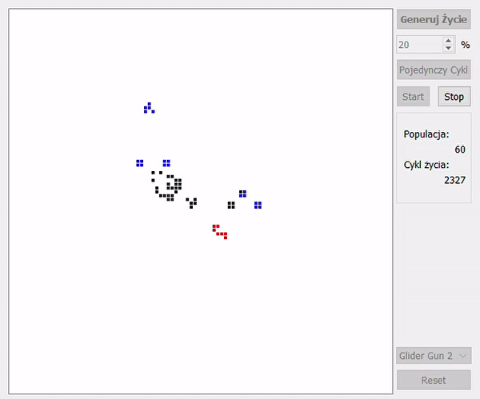
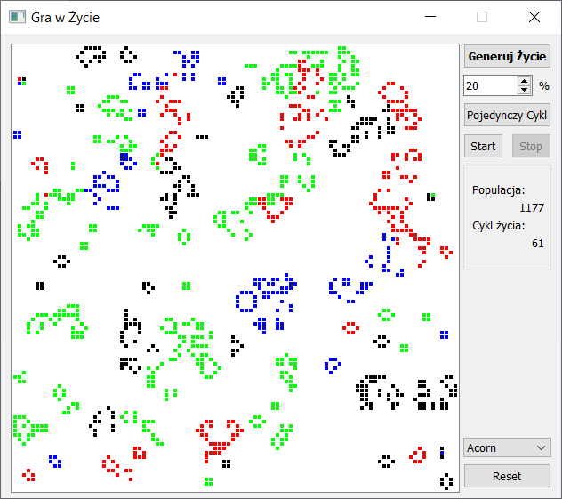

# The-game-of-life
The game of life  (project - life simulation)
Mini project written in QT Creator C++

----------

Designing a program that simulates the birth and death of cells in accordance with the "cellular automaton" algorithm.
See Wikipedia -> [link](https://pl.wikipedia.org/wiki/Gra_w_%C5%BCycie)
> The game of life (Life, The game of life) - one of the first and most famous examples of a cellular automaton, invented in 1970 by the British mathematician John Conway

